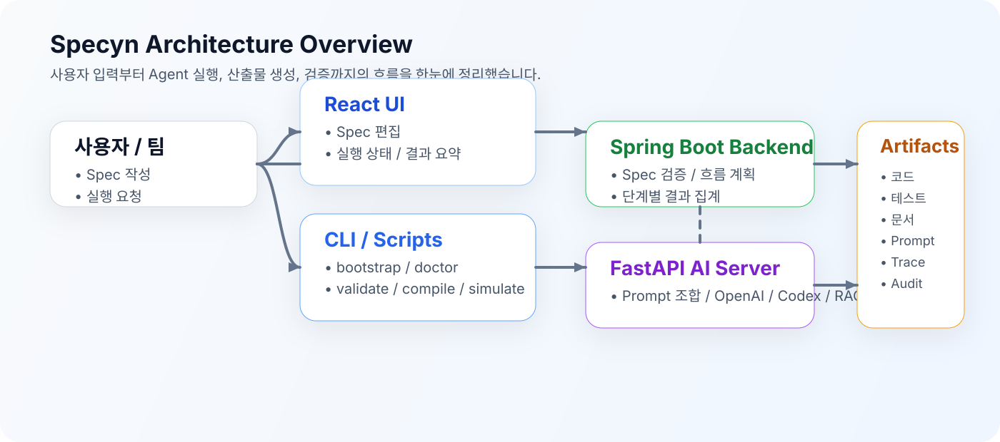

<p align="center">
  
</p>

<h1 align="center">🚀 Specyn</h1>

<p align="center">
  <a href="LICENSE"></a>
  
  
  
</p>

**Specyn**은 특정 서비스 도메인에 묶이지 않는 오픈소스 AX(AI Experience) Builder 프레임워크입니다.

단순히 한 번 실행해 보고 끝나는 데모가 아닙니다.  
기획부터 스펙 관리, 코드 생성, 테스트, 리뷰, 문서화, 그리고 CI 검증까지 이어지는  
**SDD(Spec Driven Development) 기반의 프로덕션 지향 골격**을 제공합니다.

덕분에 현업 팀이 각자의 도메인과 인프라에 맞게 확장해 나갈 수 있는 시작점을 조금 더 안정적으로 잡아갈 수 있습니다.

<a id="toc"></a>

## 📚 목차

- [왜 Specyn인가요?](#why-specyn)
- [주요 기능](#key-features)
- [아키텍처 개요](#architecture-overview)
- [저장소 구조](#repository-structure)
- [빠른 시작](#quick-start)
- [문서 안내](#documentation)
- [guide 디렉터리 안내](#guide-directory)
- [향후 로드맵](#roadmap)

<a id="why-specyn"></a>

## 🤔 왜 Specyn인가요?

팀에 AX Builder나 Agentic Development를 도입하려고 하면 보통 아래와 같은 장벽을 먼저 만나게 됩니다.

- 어떤 스펙(Spec)부터 작성해야 하는지 기준이 모호합니다.
- 기획, API, UI, 백엔드, 테스트 담당자가 서로 다른 언어로 소통하게 됩니다.
- 코드 생성은 되더라도 검증, 리뷰, 문서화가 흐름에서 빠지기 쉽습니다.
- 예제 프로젝트는 있어도 현업에 바로 맞춰 쓰기에는 빈칸이 많습니다.

Specyn은 이 문제를 줄이기 위해 아래 요소를 한 묶음으로 제공합니다.

| 구성 요소 | 역할 |
|---|---|
| 핵심 스펙 번들 | 제품/계약/테스트/리뷰/에이전트 흐름의 기준을 잡아줍니다. |
| 에이전트 카탈로그 | 역할 분리와 handoff 규칙을 문서화해 줍니다. |
| 크로스 플랫폼 스크립트 | Windows, Linux, macOS에서 같은 흐름으로 진입할 수 있게 도와줍니다. |
| 최소 CI | 백엔드·파이썬·프런트엔드 검증 흐름을 빠르게 확인할 수 있게 해줍니다. |

<a id="key-features"></a>

## ✨ 주요 기능

- 한국어 중심의 SDD(Spec Driven Development) 템플릿을 제공합니다.
- 역할 기반 Multi-Agent 협업과 bounded feedback loop 구조를 지원합니다.
- Spring Boot(오케스트레이터), FastAPI(AI 서버), React(UI) 모노레포 구성을 제공합니다.
- 테스트, 리뷰, 문서화까지 이어지는 Agent handoff 흐름을 제공합니다.
- AWS, 온프레미스, Kubernetes 확장을 고려한 유연한 구조를 제공합니다.

> 💡 Specyn은 특정 조직의 리소스 생성 방식이나 보안 정책을 강제하지 않습니다.  
> 프로덕션으로 확장 가능한 **프레임워크**에 가깝습니다.

<a id="architecture-overview"></a>

## 🏗 아키텍처 개요

<p align="center">
  
</p>

Specyn의 큰 흐름은 아래처럼 이어집니다.

```text
[사용자 / 팀]
   │
   ├─ React UI (Spec 편집, 실행 요청, 결과 요약)
   │
   └─ CLI (초기화, 검증, 프롬프트 컴파일, 시뮬레이션)
          │
          ▼
    [Spring Boot Backend] (Spec 검증, 에이전트 실행 흐름 계획)
          │
          ▼
    [FastAPI AI Server] (프롬프트 조합, OpenAI 호출, Codex 실행, RAG 검색)
          │
          ▼
    [Workspace / Artifacts] (코드 생성, 테스트/문서 산출물, 프롬프트 스냅샷)
```

좀 더 자세한 설명은 [전체 아키텍처 문서](docs/architecture.md)에서 바로 보실 수 있습니다.

<a id="repository-structure"></a>

## 📂 저장소 구조

```text
/specyn
├── backend                # Spring Boot 오케스트레이터
├── ai-server              # FastAPI + Responses + Codex + RAG
├── frontend               # React(Vite) 기반 Spec Editor / 실행 UI
├── agents                 # 에이전트 정의서
├── specs                  # 스펙 템플릿 및 예제 번들
├── tools                  # CLI 구현체, 프롬프트 컴파일러, validator
├── scripts                # 크로스 플랫폼 task runner
├── ci                     # 로컬 CI 보조 스크립트
├── docs                   # 온보딩, 빠른 시작, 플레이북, 아키텍처 문서
├── guide                  # 운영, 유지보수, 확장 가이드
└── specyn.py              # 프로젝트 CLI 진입점
```

- `docs`는 **처음 도입하는 팀**이 빠르게 읽을 수 있도록 정리했습니다.
- `guide`는 **운영·유지보수·확장** 관점에서 더 깊게 보실 때 도움이 되도록 분리했습니다.
- 기존의 `docs/00~12` 문서는 그대로 두었고, 새 문서 세트는 읽기 쉬운 이름으로 다시 정리했습니다.

<a id="quick-start"></a>

## 🚀 빠른 시작

Docker나 시스템 Gradle, OpenAI API Key 없이도 가장 빠르게 Specyn의 기본 흐름을 검증해 볼 수 있습니다.  
필수 준비물은 **Python 3.12+**, **Node.js 20+**입니다.

### Linux / macOS

```bash
cp .env.example .env
make bootstrap
make doctor
make validate-spec
make compile-prompts
make run-sim
```

### Windows (PowerShell)

```powershell
Copy-Item .env.example .env
python scripts/specyn_tasks.py bootstrap
python scripts/specyn_tasks.py doctor
python scripts/specyn_tasks.py validate-spec
python scripts/specyn_tasks.py compile-prompts
python scripts/specyn_tasks.py run-sim
```

위 흐름을 통해 예제 스펙 번들의 유효성을 검사하고, 에이전트 실행 흐름을 해석한 뒤, 로컬 시뮬레이션까지 확인하실 수 있습니다.

- 빠르게 따라가시려면 [빠른 시작 문서](docs/quickstart.md)를 먼저 보시면 됩니다.
- 초급부터 고급 적용까지 한 번에 보고 싶다면 [적용 플레이북](docs/playbook.md)을 보시면 됩니다.

<a id="documentation"></a>

## 📚 문서 안내

처음 들어오신 분은 [문서 허브](docs/README.md)부터 보시는 것을 권장드립니다.

| 문서 | 추천 대상 | 설명 |
|---|---|---|
| [docs/quickstart.md](docs/quickstart.md) | 처음 실행하는 분 | 가장 실패 가능성이 낮은 진입 순서를 안내합니다. |
| [docs/playbook.md](docs/playbook.md) | 초급~고급 적용이 필요한 팀 | 학습용, 파일럿, 현업 적용 흐름을 단계별로 정리했습니다. |
| [docs/architecture.md](docs/architecture.md) | 구조를 먼저 이해하고 싶은 분 | 컴포넌트 책임, 실행 흐름, 확장 방향을 한눈에 설명합니다. |
| [docs/agent-catalog.md](docs/agent-catalog.md) | Agent 역할 분리가 궁금한 분 | 기본 에이전트 카탈로그와 feedback loop 설계를 설명합니다. |
| [docs/sdd-principles.md](docs/sdd-principles.md) | Spec 작성 기준이 필요한 분 | Spec bundle 작성 원칙과 필수 문서를 정리했습니다. |
| [docs/operations.md](docs/operations.md) | 실행/운영 흐름이 필요한 분 | 실행 모드, 환경 변수, CI 흐름을 정리했습니다. |
| [docs/prompt-engineering.md](docs/prompt-engineering.md) | 프롬프트 품질 기준이 필요한 분 | Prompt, handoff, guardrail 원칙을 정리했습니다. |
| [docs/troubleshooting.md](docs/troubleshooting.md) | 실행 중 막힌 분 | 자주 발생하는 문제와 해결 순서를 정리했습니다. |

<a id="guide-directory"></a>

## 🧭 guide 디렉터리 안내

`guide` 디렉터리는 운영, 유지보수, 확장 관점에서 더 깊이 있는 설명이 필요할 때 보시면 좋습니다.

| 문서 | 설명 |
|---|---|
| [guide/local-development.md](guide/local-development.md) | 서비스별 개별 실행, 포트, health check, 로컬 운영 팁을 정리했습니다. |
| [guide/maintainer.md](guide/maintainer.md) | 메인테이너 체크리스트와 문서/코드 동기화 포인트를 정리했습니다. |
| [guide/traceability.md](guide/traceability.md) | 향후 대시보드·감사 추적을 위한 trace metadata 규약을 설명합니다. |
| [guide/roadmap.md](guide/roadmap.md) | 온프레미스, Kubernetes, Queue, Audit 확장 방향을 정리했습니다. |

<a id="roadmap"></a>

## 🗺 향후 로드맵

Specyn은 지속적으로 성장하고 있으며, 앞으로 아래와 같은 확장을 준비하기 좋도록 구조를 열어 두었습니다.

- 에이전트 실행 추적 대시보드 (Trace / Execution Timeline)
- Queue 기반 비동기 실행기
- 조직별 Policy Pack / Review Pack
- Prompt snapshot / artifact catalog / reviewer audit 체계

---

Specyn은 단순한 코드 생성 도구가 아니라,  
**팀의 개발 프로세스를 스펙 중심으로 정렬해 주는 프레임워크**에 가깝습니다.

작게 시작해 보시고, 팀의 운영 방식에 맞게 천천히 확장해 보시면 좋겠습니다.
